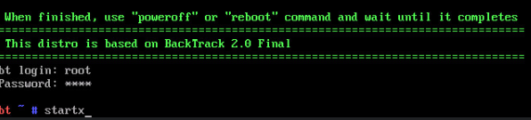
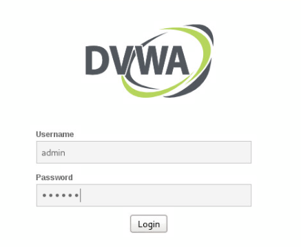
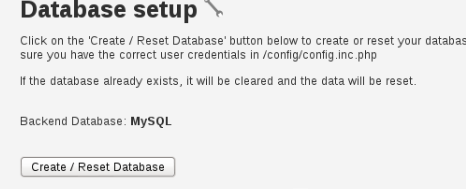

# 🔍Analyzing Types of Web Application Attacks🌐

1\. Launch the DVL virtual machine.

2\. On the login screen, type root followed by pressing the Enter key.

3\. When prompted for a password, type toor and press Enter again.

4\. When presented with the user prompt, type startx and then press Enter.

5\. Once the graphical user interface appears, start the WebGoat web
server by clicking on the Application Menu and navigate through Damn
Vulnerable Linux \> Training Material \> Web Exploitation \> Webgoat \>
Start WebGoat port 80.

6\. A new terminal window will appear, showing the WebGoat startup process. Leave this shell open and minimize it for now.

7\. Open the Firefox web browser by clicking on the icon located on the bottom taskbar.

8\. While in Firefox, type http://127.0.0.1/WebGoat/attack (case-sensitive) into the address field, followed by pressing the Enter
key.

9\. When prompted for authentication, type password. Click OK. guest as the username and guest as the Click OK.

10\. Once authenticated, you are welcomed to the WebGoat Welcome page.
Click the Start WebGoat button.

11\. Once the page redirects, click on the Injection Flaws menu item
located on the left; this will open more options.

12\. Click on String SQL Injection.

13\. At the top-right of the webpage, click on Restart this Lesson.

14\. Type Smith into the Enter your last name text field and click on the Go! button.

>Note that this is how the query is meant to be used . You type in an
>input and expect the proper output. In this case, we searched for users
>with the last name Smith and we received information from the database
>regarding all the Smiths.

15\. Click on Restart this Lesson.

16\. Inject the user_data database table with a popular injection
technique so that you can potentially leak all user information stored
in the table. Type the string below in the Enter your last name text
field.

17\. Click the Go! button.

18\. After the successful inject, click on Stage 1: String SQL Injection
from the left menu.

19\. You will be redirected to a Human Resource login page. Select Neville Bartholomew (admin) from the drop-down box. Attempt to login
without a password by pressing the Login button.

20\. No access has been given. On the Firefox window, select Tools from the top menu and click on the Tamper Data tool.

21\. A new Tamper Data application window will appear. Click the Start Tamper file menu option.

22\. Change focus to the WebGoat web page. Select Neville Bartholomew (admin) once more from the user list and click the Login button.

23\. Notice a new pop-up message from the Tamper Data tool appears. Click the Tamper button to proceed.

24\. In the new Tamper Popup window, type the string field. Click OK. or 1=1-- into the password

25\. Once the tool finishes its process, click Stop Tamper from the file
menu

26\. Notice the successful SQL injection on the WebGoat web page. We now have access to the user database as the administrator. Select the first
user from the list; Larry Stooge and click the ViewProfile button.

27\. Notice that we have complete control over all user profiles and complete access to their personal information.

28\. Close the Firefox web browser.

**1.2 Using DVWA for SQL Injection**

1\. Launch the Kali virtual machine to access the graphical login
screen.

2\. Log in as root with toor as the password.

3\. Open a new terminal window by clicking on the terminal icon located
in the top toolbar.

4\. Within the terminal, type the command below followed by pressing the
Enter key to list the currently active network interfaces on the system.

5\. Bring the loopback interface to an active state.

6\. Verify that the loopback interface is now up.

7\. Start the mysql service by entering the command below.

8\. Start the apache web service.

9\. Open the Iceweasel web browser by clicking the on the web browser
icon located on the top menu pane.

10\. In the address field, type http://127.0.0.1/dvwa/login.php. Press
Enter.

11\. On the login page, type Login. admin for the username and password
for the password.

12\. Click on the DVWA Security menu option located on the left.

13\. Change the security level to low from the drop-down menu and click
Submit.

14\. Confirm that the Security level is currently set to low.

15\. Click on SQL Injection from the left menu.

16\. Type in the number zero 0in the User ID: text field and click
Submit.

17\. Notice no output is given. Type in the number one click Submit. 1in
the User ID: text field and CLICK SUBMIT

18\. Attempt to use the “always true” SQL injection technique by typing
the string below into the User ID field.

19\. Now you can see the account names in the database. Verify that you
can see all five accounts.

20\. Type another string in the User ID: field to query the version of
the database.

21\. Take note of the mysql database version that is given to us.

22\. Type another string in the User ID: field to query the database
name. Click Submit.

23\. Take note of the mysql database name that is given to us.

24\. Type another string in the User ID: field to query for all tables
in the information_schema database.

25\. Take note of all the different table information next to Surname.
The information_database stores information about all the databases that
the mysql server maintains.

26\. Type another string in the User ID: field to query for all column
content in the user table.

27\. Notice the amount of the user information given to us along with
their respective credentials.

28\. Leave the DVWA web page open for the next task.

## 2\. Cross Site Scripting XSS

2.1 Using DVWA for XSS

1\. While on the DVWA web page, click on XSS stored from the left menu
pane

2\. On this page, you are presented with a form that is mimicking a
comment section where users can write their comments. Make a test XSS
exploit by typing XSS1 in the Name text field. Type the script below
into the Message text field. Click the Sign Guestbook button.

3\. Notice the popup message showing the same text you have inputted
between the quotations. With this vulnerability, every time a user views
this page they will experience the XSS exploit just as it shows now.
Click OK.

4\. Click on the Setup menu option located to the left.

5\. Once redirected, click on the Create / Reset Database button.

6\. Click on the XSS Stored menu option.

7\. For the Name, type Sign Guestbook. iframe1. Type the script below
into the Message field. Click on

8\. Scroll down and notice the iframe presented on the screen. You
should see Kali’s homepage within the iframe.

9\. Click on the Setup menu option.

10\. Once redirected, click on the Create / Reset Database button.

11\. Click on the XSS Stored menu option.

12\. For the name, type Sign Guestbook. cookie1. Type the script below
into the Message field. Click on Sign Guestbook

13\. A pop-up alert appears showing the user’s cookie information. In
this case, it is your cookie information. This script can be modified in
a way where if a malicious attacker may decide to forward cookie
information to a remote server and use man in-the-middle techniques to
steal personal information on a banking website for example. Click OK.

14\. The lab is now complete; you may end the reservation.
